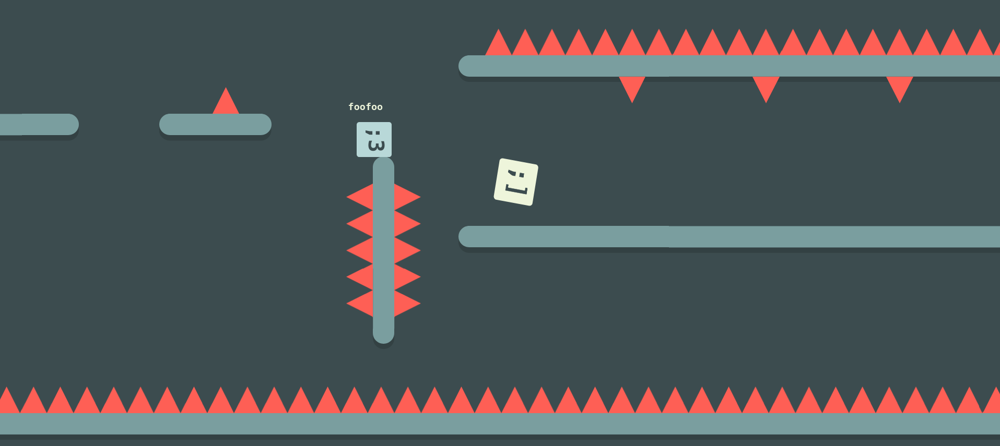

# Rundash
*1.0.3*

A casual, online multiplayer racing platformer! The graphics are all HTML/CSS, no canvas needed! Networking is done with websockets. Server is written in Python 3, client in plain ol' JavaScript.

## Running a Server
To run a server, you need to run:

```pip3 i -r requirements.txt```

then:

```python3 server.py [PORT] [DEBUG?]```

## Minification
For security, the server will run uglify-js on the game javascript code to ensure that users cannot (easily) cheat.